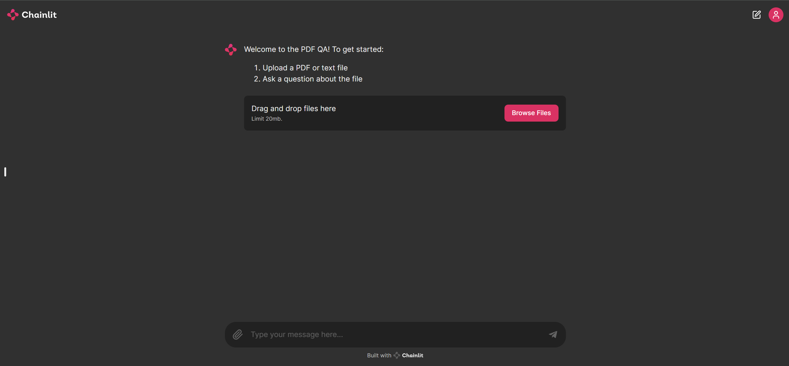
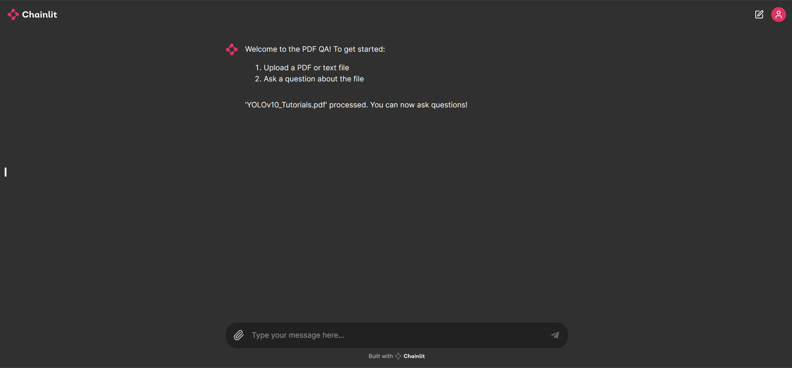
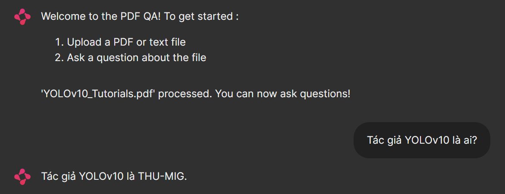

# Chatbot with Chainlit and RAG techniques

## Overview

This project utilizes Chainlit, Retrieval Augmented Generation (RAG), and Large Language Models (LLMs) to build a chatbot capable of answering questions based on the content of uploaded PDF documents. By integrating RAG, the chatbot enhances the quality of generated responses by retrieving relevant content from the provided documents.

### Key Features

- **Document Upload**: Users can upload PDF or text files.
- **Question Answering**: Users can ask questions related to the content of the uploaded documents.
- **Enhanced Responses**: The system retrieves relevant content from documents to improve response accuracy.

## Installation

To set up the project on your local machine, follow these steps:

1. **Clone the Repository**:

   ```sh
   git clone https://github.com/huytranhk13cqt/RAG_QA_PDF.git
   cd RAG_QA_PDF
   ```

2. **Install Required Packages**:
   Ensure you have Python 3.8 or above. Install the necessary packages using pip:
   ```sh
   pip install transformers==4.41.2 bitsandbytes==0.43.1 accelerate==0.31.0 langchain==0.2.5 langchainhub==0.1.20 langchain-chroma==0.1.1 langchain-community==0.2.5 langchain-huggingface==0.0.3 python-dotenv==1.0.1 pypdf==4.2.0 numpy==1.24.4 chainlit==1.1.304
   ```

## Usage

To run the project, execute the following command in your terminal:

```sh
chainlit run app.py --host 0.0.0.0 --port 8000
```

### Steps to Use the Chatbot

1. **Start the Application**:
   Open your terminal and run the above command to start the Chainlit application.
2. **Upload a Document**:
   - Open your web browser and go to `http://localhost:8000`.
   - Upload a PDF or text file using the interface.
3. **Ask Questions**:
   - Once the document is processed, you can start asking questions related to the content of the uploaded document.

### Example





## Recognitions

This project is part of the AI VIET NAM – AI COURSE 2024. The project utilizes the following key technologies and libraries:

- **[Chainlit](https://docs.chainlit.io/get-started/overview)**: For building the chatbot interface.
- **[LangChain](https://langchain.com/)**: For implementing RAG and document processing.
- **[Transformers](https://huggingface.co/transformers/)**: For leveraging state-of-the-art language models.
- **[Vicuna](https://lmsys.org/blog/2023-03-30-vicuna/)**: The language model used for generating responses.

Special thanks to the contributors and the AI VIET NAM community for their support and resources.
